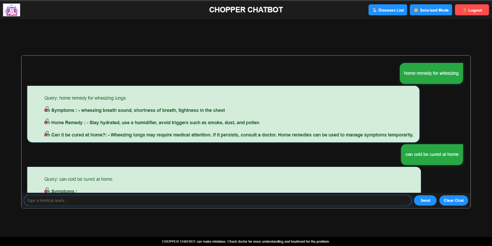
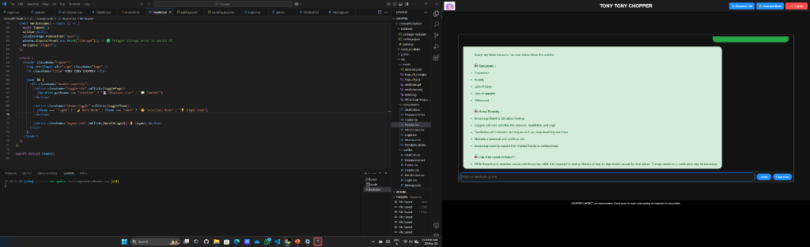
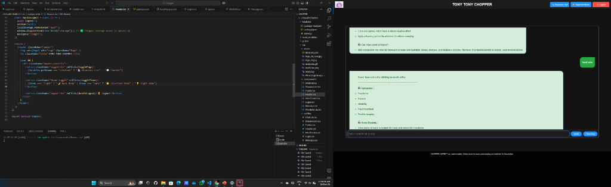
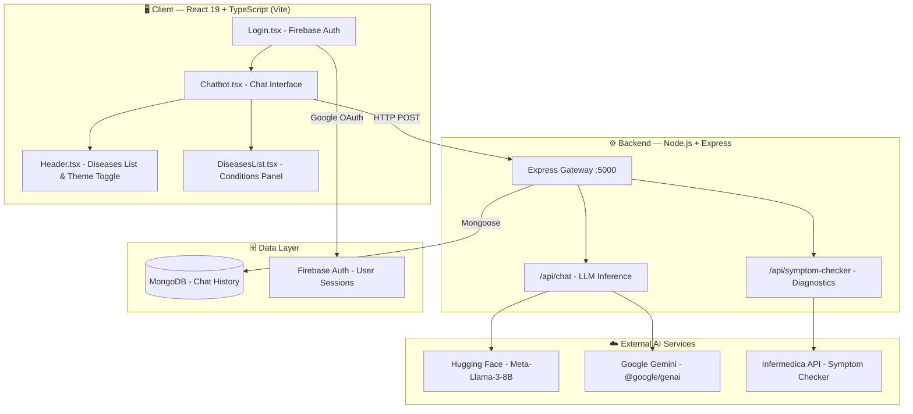

<div align="center">


# 🚁 Chopper Online — AI Health Chatbot

**Ask. Diagnose. Heal. — Your intelligent medical companion powered by LLMs.**

<br/>

[](https://react.dev)
[](https://www.typescriptlang.org)
[](https://nodejs.org)
[](https://expressjs.com)
[](https://mongodb.com)
[](https://firebase.google.com)
[](https://huggingface.co)
[](https://vitejs.dev)

<br/>

> ⚠️ **Disclaimer:** CHOPPER CHATBOT can make mistakes. Always consult a doctor for professional medical advice and treatment.

</div>

---

## 📌 Table of Contents

- [Overview](#-overview)
- [Screenshots](#-screenshots)
- [Features](#-core-features)
- [Architecture](#-system-architecture)
- [Tech Stack](#-tech-stack)
- [Getting Started](#-getting-started)
- [Environment Variables](#%EF%B8%8F-environment-configuration)
- [API Reference](#-api-reference)
- [Project Structure](#-project-structure)
- [Security](#-security--best-practices)

---

## 🩺 Overview

**Chopper Online** is a full-stack, production-grade AI health assistant chatbot named after the beloved doctor from *One Piece*. It combines the power of **Large Language Models (LLMs)**, **symptom-checking APIs**, and a **React 19 + TypeScript** frontend to deliver real-time, contextual medical information in a conversational interface.

Users can ask natural language health queries and receive structured responses — including **symptoms**, **home remedies**, and **when to see a doctor** — all backed by Hugging Face and Google Gemini AI models.

---

## 📸 Screenshots

### 💬 Chatbot in Action

> Type a health query and receive structured AI-powered responses instantly.

<div align="center">
  
  <br/>
  <em>Querying home remedies for wheezing lungs — the chatbot returns symptoms, remedies, and medical advice.</em>
</div>

---

### 🛠️ Development Environment

> Built with VS Code, React 19, TypeScript, and a decoupled backend architecture.

<div align="center">
  
  <br/>
  <em>VS Code side-by-side: React component code on the left, live chatbot on the right with symptom checker panel.</em>
</div>


<br/>

<div align="center">
  
  <br/>
  <em>Detailed response panel — showing symptoms, treatment options, and cure information for various conditions.</em>
</div>

---

## ✨ Core Features

| Feature | Description |
|---|---|
| 🧠 **LLM-Powered Chat** | Integrates with Hugging Face (`Meta-Llama-3-8B`), OpenAI, and Google Gemini for contextual health responses |
| 🔬 **Symptom Checker** | Probabilistic diagnostic engine (Infermedica API) maps symptoms, age & sex to likely diagnoses |
| 🔐 **Firebase Authentication** | Secure Google login with protected routes — only authenticated users can access the chatbot |
| 🗄️ **Persistent Chat History** | MongoDB-backed session storage to retrieve previous conversations |
| 🎨 **Solarized Mode** | Toggle between dark and solarized light themes for comfortable usage |
| 📋 **Diseases List** | Dedicated page listing conditions supported by the chatbot |
| ⚡ **Blazing Fast Frontend** | Built on Vite 6 + React 19 with HMR and instant builds |
| 🌐 **Multi-Deployment** | Configured for Firebase Hosting, Vercel, and GitHub Pages |

---

## 🏗️ System Architecture



---

## 🧰 Tech Stack

### Frontend
| Technology | Version | Purpose |
|---|---|---|
| React | `^19.0.0` | UI framework |
| TypeScript | `~5.7.2` | Type-safe development |
| Vite | `^6.1.0` | Build tool & dev server |
| React Router DOM | `^7.2.0` | Client-side routing |
| Firebase | `^11.3.1` | Authentication & Hosting |
| `@google/genai` | `^2.19.0` | Google Gemini AI SDK |
| `@huggingface/inference` | `^4.13.28` | Hugging Face Inference SDK |

### Backend
| Technology | Version | Purpose |
|---|---|---|
| Node.js + Express | `^4.21.2` | REST API server |
| MongoDB + Mongoose | `^8.10.1` | Database & ORM |
| OpenAI SDK | `^4.85.3` | LLM API client (HF-compatible) |
| dotenv | `^16.4.7` | Environment variable management |
| CORS | `^2.8.5` | Cross-origin request handling |

---

## 🚀 Getting Started

### Prerequisites

- **[Node.js](https://nodejs.org/)** v18+
- **[MongoDB](https://mongodb.com/)** locally on port `27017`, or a [MongoDB Atlas](https://www.mongodb.com/atlas) URI
- **[Git](https://git-scm.com/)**

### Clone the Repository

```bash
git clone https://github.com/your-username/ChopperOnline.git
cd ChopperOnline
```

---

## ⚙️ Environment Configuration

### Backend — `backend/.env`

```bash
cp backend/.env.example backend/.env
```

```env
PORT=5000

# MongoDB Connection
MONGODB_URI=mongodb://localhost:27017/chopperdb

# AI / LLM Configuration
OPENAI_API_KEY=your_huggingface_or_openai_api_key
OPENAI_BASE_URL=https://api-inference.huggingface.co/v1/
OPENAI_MODEL=meta-llama/Meta-Llama-3-8B-Instruct

# Infermedica Diagnostic API
INFERMEDICA_APP_ID=your_infermedica_app_id
INFERMEDICA_API_KEY=your_infermedica_api_key
```

### Frontend — `.env`

```env
# Firebase config
VITE_FIREBASE_API_KEY=your_firebase_api_key
VITE_FIREBASE_AUTH_DOMAIN=your_project.firebaseapp.com
VITE_FIREBASE_PROJECT_ID=your_project_id
VITE_FIREBASE_APP_ID=your_firebase_app_id

# Google Gemini
VITE_GEMINI_API_KEY=your_gemini_api_key

# Backend API
VITE_BACKEND_URL=http://localhost:5000/api
```

---

## 💻 Installation & Running

#### 1. Start the Backend API

```bash
cd backend
npm install
npm start
# ✅ API running at http://localhost:5000/api
```

#### 2. Start the Frontend App

```bash
npm install
npm run dev
# ✅ App running at http://localhost:5173
```

---

## 📡 API Reference

| Endpoint | Method | Request Body | Response |
|---|:---:|---|---|
| `/api/chat` | `POST` | `{ "question": "string" }` | AI response with symptoms, remedy & cure info |
| `/api/symptom-checker` | `POST` | `{ "age": int, "sex": "string", "symptoms": ["..."] }` | Probabilistic diagnosis with condition list |

### Example — Chat Request

```bash
curl -X POST http://localhost:5000/api/chat \
  -H "Content-Type: application/json" \
  -d '{"question": "home remedy for wheezing lungs"}'
```

### Example — Symptom Checker Request

```bash
curl -X POST http://localhost:5000/api/symptom-checker \
  -H "Content-Type: application/json" \
  -d '{"age": 25, "sex": "male", "symptoms": ["headache", "fever", "nausea"]}'
```

---

## 📁 Project Structure

```
chHealthChatBot/          <- Repo Root
├── 📁 src/
│   ├── 📁 components/    # Chatbot · Header · Login · DiseasesList · Footer · Message
│   ├── 📁 services/      # API call wrappers (chat, symptom checker)
│   ├── 📁 cssFiles/      # Component-level stylesheets
│   ├── 📁 assets/        # Static assets
│   ├── App.tsx           # Root component + routing
│   └── main.tsx          # App entry point
├── 📁 backend/           # Node.js + Express REST API
│   ├── 📁 config/        # MongoDB connection setup
│   ├── 📁 models/        # Mongoose schemas
│   ├── 📁 routes/        # chatRoutes.js · symptomRoutes.js
│   ├── 📁 services/      # LLM & Infermedica service logic
│   └── server.js         # Express app entry point
├── 📁 screenshots/       # Project screenshots
├── medicine.gif          # Header animation asset
├── server.ts             # Express SSR / proxy server
├── vite.config.ts        # Vite build configuration
├── tsconfig.json         # TypeScript configuration
├── firebase.json         # Firebase Hosting config
└── .env.example          # Environment variable template
```

---

## 🛡️ Security & Best Practices

- **🔐 Firebase Auth** — All chatbot routes are protected behind Google OAuth via `PrivateRoute.tsx`
- **🌐 CORS Configured** — Backend explicitly allows requests only from the permitted client origin
- **🔒 Environment Isolation** — All API keys and secrets are stored in `.env` files, excluded from version control via `.gitignore`
- **📦 Modern SDK** — Uses OpenAI SDK v4 for robust LLM error handling and streaming payload delivery
- **⚡ Type Safety** — Full TypeScript coverage on the frontend prevents runtime type errors

---

## 🌐 Deployment

| Platform | Config File |
|---|---|
| 🔥 Firebase Hosting | `firebase.json` · `.firebaserc` |
| ▲ Vercel | `.vercel/` |
| 📄 GitHub Pages | `gh-pages` script in `package.json` |

---

<div align="center">

**Built with ❤️ and inspired by Tony Tony Chopper — the doctor who fights for his crew.**

*"I don't want to conquer anything. I just think the guy with the most freedom in this ocean... is the Pirate King!"* — but Chopper prefers to heal 🍵

</div>

